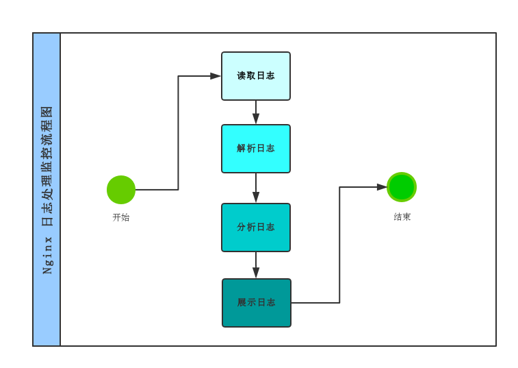
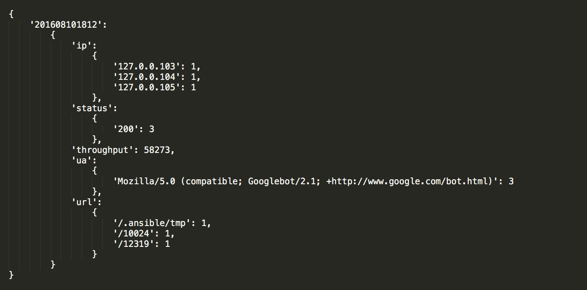
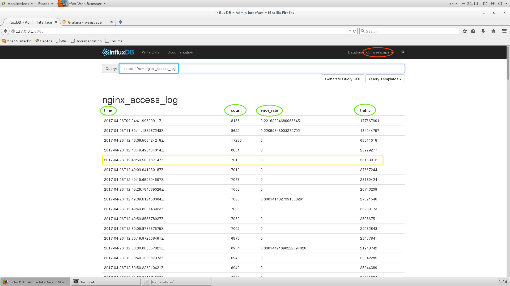
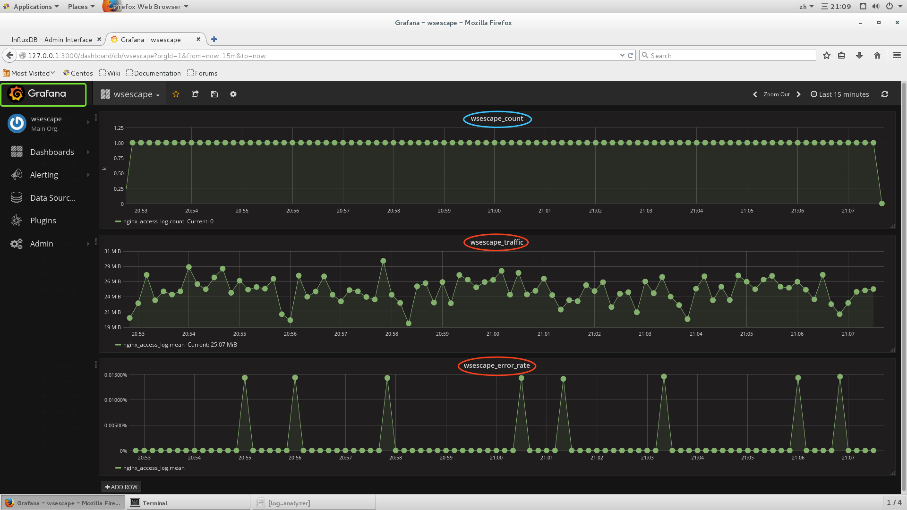

<p align=center>
  <a href="https://github.com/EscapeLife/love_girlfriend.git">
    
  </a>
</p>

<p align=center>
  <b>web-log-analyst 🐌 Nginx日志分析处理监控</b>
</p>

<p align="center">
  <a href="https://github.com/EscapeLife/awesome-builder.git"></a>
  <a href="https://github.com/EscapeLife/awesome-builder.git"></a>
  <a href="https://github.com/EscapeLife/awesome-builder.git"></a>
</p>


## 项目目录

- [1. 功能描述](https://github.com/EscapeLife/web-log-analyst#1-%E5%8A%9F%E8%83%BD%E6%8F%8F%E8%BF%B0)
- [2. 项目流程图](https://github.com/EscapeLife/web-log-analyst#2-%E9%A1%B9%E7%9B%AE%E6%B5%81%E7%A8%8B%E5%9B%BE)
- [3. 模块分析过程](https://github.com/EscapeLife/web-log-analyst#3%E6%A8%A1%E5%9D%97%E5%88%86%E6%9E%90%E8%BF%87%E7%A8%8B)
   - [3.1 解析日志文件](https://github.com/EscapeLife/web-log-analyst#31-%E8%A7%A3%E6%9E%90%E6%97%A5%E5%BF%97%E6%96%87%E4%BB%B6)
   - [3.2 分析日志文件](https://github.com/EscapeLife/web-log-analyst#32-%E5%88%86%E6%9E%90%E6%97%A5%E5%BF%97%E6%96%87%E4%BB%B6)
   - [3.3 数据结构](https://github.com/EscapeLife/web-log-analyst#33-%E6%95%B0%E6%8D%AE%E7%BB%93%E6%9E%84)
   - [3.4 展示日志文件](https://github.com/EscapeLife/web-log-analyst#34-%E5%B1%95%E7%A4%BA%E6%97%A5%E5%BF%97%E6%96%87%E4%BB%B6)
- [4. 效果展示](https://github.com/EscapeLife/web-log-analyst#4-%E6%95%88%E6%9E%9C%E5%B1%95%E7%A4%BA)
- [5. 快速构建]()


## 1. 功能描述

一个简单的日志分发、存储、监控、展示的小工具，当然你也可以将任何你关注的信息进行展示。`log_distribution.py`用来分发日志数据，变相的实现了，多日志监控的效果。`analyzer_threading.py`和`analyzer_multiprocessing.py`是利用进程以及线程的特性，对日志进行了收集、聚合、发送的效果(我们都是`python`中，`threading`多线程都是运行在一个进程当中的，所以对于多核`CPU`并没有发挥其性能；相对而言，`multiprocessing`多进程可以充分利用操作系统的性能)。将数据存储在`influxdb`流式数据库中，并利用`grafana`进行展示，当然这里你也可以使用其他的数据库展示工具都是可以的。


## 2. 项目流程图

> 通过流程图直观的解释项目的分析过程。




## 3.模块分析过程

> 注释：没有提供所需的Nginx日志文件，使用时需要结合自己的真实适用场景进行合理规划。

### 3.1 解析日志文件

对于`Web`服务器的日志输出，是由我们指定的，既可以更多的记录站点的信息也可以大致的做一下记录。当然，最重要信息肯定也是必不可少的。如下，列出了比较重要的日志记录信息。

- `IP`地址
- 用户访问时间戳
- 请求方式
- `URL`地址
- 浏览器版本
- 服务器返回状态
- 返回字节长度
- `referer`
- `UserAgent`

### 3.2 分析日志文件

通过对于`Nginx`日志的分析，我们可以得到很多东西，不只是我下面表格列出的这几条。分析得到的结果，可以有助于我们来优化网站性能、统计网站访问量以及实时展示有很大的帮助。

| 编号 | 获取到的内容 | 如果统计 | 如何展示 |
| --- | --- | --- | --- |
| 1 | 平均时间的流量 | sum | line char |
| 2 | 平均响应时间 | sum | line char |
| 3 | top 10 URL | count | bar chat |
| 4 | top 10 IP | count | bar char |
| 5 | top 10 UserAgent | count | bar char |
| 6 | 响应状态的分布 | group by | pie chat or stack chat |
| 7 | UserAgent的分布 | group by | pie chat or stack chat |
| 8 | HTTP版本的分布 | group by | pie chat or stack chat |

### 3.3 数据结构
为了便于理解，下图实例了一下，对应的数据结构便于理解和学习。



### 3.4 展示日志文件

#### 3.4.1 influxdb

**用途**

- `InfluxDB`用`Go`语言编写的一个开源分布式时序、事件和指标数据库，和传统是数据库相比有不少不同的地方
- 类似的数据库有`Elasticsearch`、`Graphite`等
- 一般用来储存实时数据，配合一套UI界面来展示信息

**安装**

```bash
# 配置yum安装源
cat <<EOF | sudo tee /etc/yum.repos.d/influxdb.repo
[influxdb]
name = InfluxDB Repository - RHEL \$releasever
baseurl = https://repos.influxdata.com/rhel/\$releasever/\$basearch/stable
enabled = 1
gpgcheck = 1
gpgkey = https://repos.influxdata.com/influxdb.key
EOF

# 安装influxdb以及启动
sudo yum install influxdb
sudo systemctl start influxdb

# 在浏览器中输入 localhost:8083 即可进入web管理页面
```

#### 3.4.2 grafana

**用途**

- 图形化动态展示

**安装**

```bash
# 配置yum安装源
[grafana]
cat <<EOF | sudo tee /etc/yum.repos.d/grafana.repo
name=grafana
baseurl=https://packagecloud.io/grafana/stable/el/6/$basearch
repo_gpgcheck=1
enabled=1
gpgcheck=1
gpgkey=https://packagecloud.io/gpg.key https://grafanarel.s3.amazonaws.com/RPM-GPG-KEY-grafana
sslverify=1
sslcacert=/etc/pki/tls/certs/ca-bundle.crt
EOF

# 安装influxdb以及启动
sudo yum install grafana
sudo systemctl start grafana-server
sudo systemctl status grafana-server

# 在浏览器中输入 localhost:3000 即可进入web管理页面
```


## 4. 效果展示

**influxdb存储数据**



**grafana监控展示**




## 5. 快速构建

> **使用Docker进行快速构建**

- Todo


## 6. 联系方式

<p align="center">
    
</p>

- **💭 [Name][^1] 💭**
  - 🐠 **[`EscapeLife`](https://www.escapelife.site)** 😏
- **💭 [Induction][^2] 💭**
  - 🏦 **[`Focusing P.A.I`](https://www.paodingai.com)** 😂
- **💭 [Email][^3] 💭**
  - 📫 **[`wenpanhappy@gmail.com`](https://www.escapelife.site)** 🤔
- **💭 [Myblog][^4] 💭**
  - 🍺 **[`https://www.escapelife.site`](https://www.escapelife.site)** 😚
- **💭 [License][^5] 💭**
  - 🚧 [**`Apache License, Version 2.0`**](http://www.apache.org/licenses/LICENSE-2.0.html)😝

[^1]: This is my nickname.
[^2]: This is my company address.
[^3]: This is my public mailbox.
[^4]: This is my blog.
[^5]: The open source protocol used by the repository.
